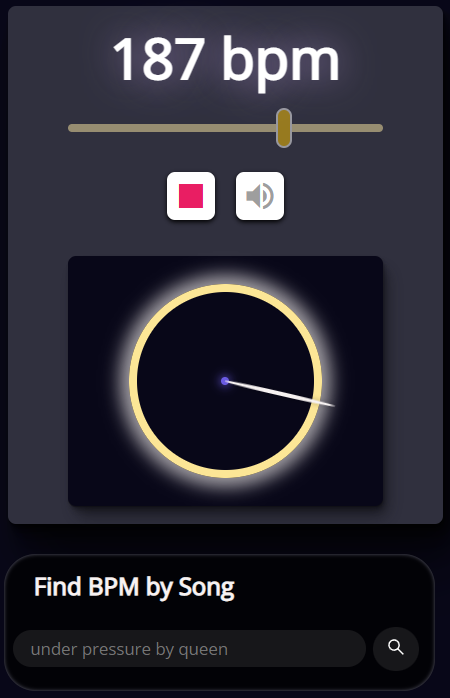

# Beat Circle

## [Live Demo Here](https://skanes17.github.io/beat-circle/)
> Select a tempo and hit play to see and hear beats. The beats can be customized, and a circle is used to help visualize the rhythm.

## General Info

- I wanted to build a first project that was cool and useful, but which would also challenge me to learn many new skills. I used my music background as a starting point to create an app that helps people to visualize rhythm in novel way. Building the app forced me to quickly learn CSS and JavaScript in order to make the app dynamic and interesting.

## Technologies Used

- HTML5
- CSS
- JavaScript (ES6)

## Features

- Select a tempo and hit play to see and hear the beats
- Customize the number and nature of each beat
- Search for a song to get its BPM

## Screenshots

## Future Iterations

- Tap tempo
- Sound library to allow more choice of beat sounds
- Improve performance on mobile devices
- Replace the GetSongBPM API with the Spotify API

## Contact

- [Scott Skanes](https://www.linkedin.com/in/sskanes/) - [scottskanes@gmail.com](scottskanes@gmail.com)
- Project Link: https://github.com/skanes17/beat-circle

## Acknowledgements

- This app was created as part of the Get Coding program
- Many thanks to my coach Leon Chisholm for his wisdom and guidance!
- The circle concept was inspired by a [John Varney TED-Ed lesson](https://youtu.be/2UphAzryVpY)
- [MDN web docs](https://developer.mozilla.org/)
- [Josh W Comeau CSS Tutorials](https://www.joshwcomeau.com/tutorials/css/)
- [CSS Tricks](https://css-tricks.com/)
- [Google Fonts](https://fonts.google.com/)
- [Paletton](http://paletton.com/)
- Countless other websites and YouTube videos
